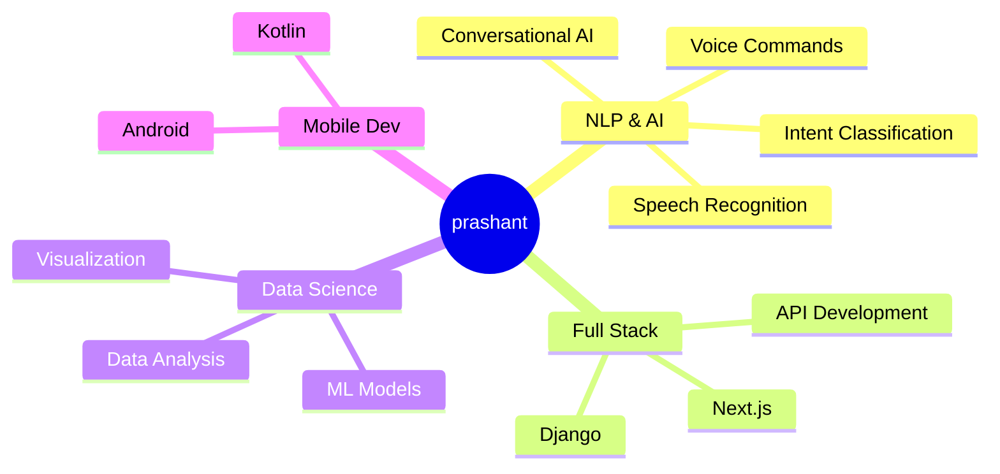

<div align="center">

# 🌙 prashant


```
╔══════════════════════════════════════════════╗
║  "full time procastinator, part time coder"  ║
╚══════════════════════════════════════════════╝
```
</div>

---


### 🕯️ About Me

```yaml
name: prashant
education: 
  major: Computer Science
  minor: Mathematics
  
current_focus:
  - Natural Language Processing (NLP)
  - Conversational AI Systems
  - Voice Command Based AI
  - Speech Recognition & Synthesis
  
```

<br clear="both">

---

### 🛠️ Tech Stack

<div align="center">

#### Languages
          

#### AI/ML & Data Science
    

#### Frameworks & Tools
  

#### Development Tools
     

</div>

<div align="center">

</div>

---

### 🎯 Professional Focus

<div align="center">



</div>

---

### Industry-Ready Skills

<table align="center">
<tr>
<td align="center" width="50%">

**🤖 AI & Machine Learning**
- Natural Language Processing
- Deep Learning (TensorFlow, PyTorch)
- Computer Vision (OpenCV)
- Model Training & Deployment
- Voice Recognition Systems

</td>
<td align="center" width="50%">

**🌐 Full Stack Development**
- RESTful API Design
- Real-time Communication (Twilio)
- Database Management (SQL)
- Responsive Web Design
- Mobile App Development

</td>
</tr>
<tr>
<td align="center" width="50%">

**📊 Data Science & Analytics**
- Statistical Analysis (R)
- Data Manipulation (Pandas, NumPy)
- Data Visualization (Tableau)
- Predictive Modeling
- ETL Processes

</td>
<td align="center" width="50%">

**🛠️ DevOps & Collaboration**
- Version Control (Git/GitHub)
- Agile Methodologies
- Code Documentation
- Technical Writing
- Cross-functional Collaboration

</td>
</tr>
</table>

---

### 📊 GitHub Analytics

<div align="center">


</div>

<div align="center">

</div>

<div align="center">


</div>

---

### 🐍 Contribution Snake

<div align="center">
  <picture>
    <source media="(prefers-color-scheme: dark)" srcset="https://raw.githubusercontent.com/heyitsprashant/heyitsprashant/output/github-contribution-grid-snake-dark.svg">
    <source media="(prefers-color-scheme: light)" srcset="https://raw.githubusercontent.com/heyitsprashant/heyitsprashant/output/github-contribution-grid-snake.svg">
    
  </picture>
</div>

---

### 📫 Connect With Me

<div align="center">

[](mailto:basyalprashant369@gmail.com) [](https://linkedin.com/in/prashantbasyal) [](https://basyalprashant.com.np/) [](https://github.com/heyitsprashant)

</div>

---

<div align="center">


<br>

```text
"Building AI that listens, learns, and responds."
```

### Open to collaborations on AI/ML projects

</div>
